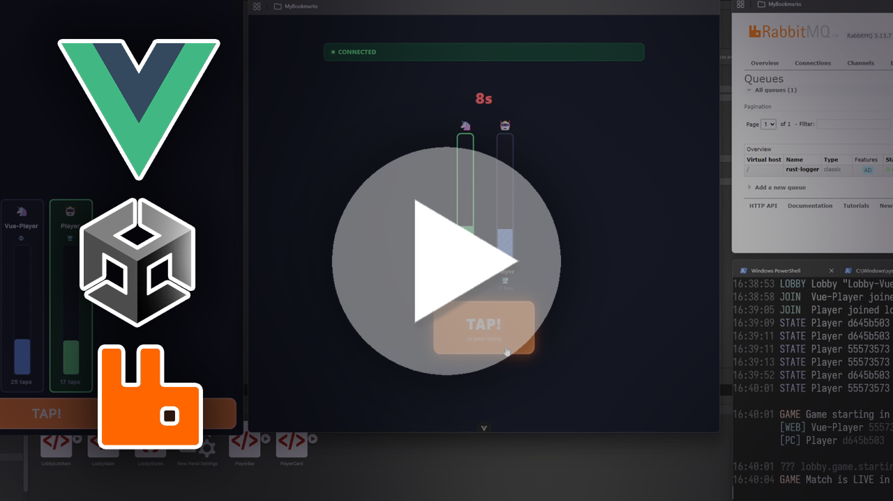

# ToTheTop

A multiplayer tap-racing game with a real-time lobby system. Players join lobbies, ready up, and compete to fill their progress bar first by tapping as fast as possible.

Built with ASP.NET Core (backend), Vue 3 (web client), Unity (desktop client), RabbitMQ (event bus), and a Rust event logger.

[](https://youtu.be/xwUNJAS3lJg)

## Architecture

- **ToTheTopDotnet** - ASP.NET Core 9 backend with SignalR for real-time communication and REST APIs for lobby/game management
- **ToTheTopVue** - Vue 3 + TypeScript frontend dashboard for browsing and joining lobbies
- **ToTheTop** - Unity game client with SignalR integration
- **RabbitMQ** - Message broker for publishing game and lobby events
- **rust-logger** - Rust service that consumes RabbitMQ events and logs them to the console

## Prerequisites

- [Docker](https://www.docker.com/) (for RabbitMQ)
- [.NET SDK](https://dotnet.microsoft.com/download/dotnet/9.0)
- [Node.js](https://nodejs.org/)
- [Rust](https://www.rust-lang.org/tools/install) (for the event logger, optional)
- Unity (if building the game client from source)

## Running the Project

### 1. Start RabbitMQ

```bash
docker compose up
```

RabbitMQ management UI will be available at `http://localhost:15672` (username: `guest`, password: `guest`).

### 2. Start the .NET Backend

```bash
cd ToTheTopDotnet
dotnet run
```

The backend runs at `http://localhost:5082`. This hosts both the REST API and the SignalR hub at `/hub/lobby`.

### 3. Start the Vue Frontend

```bash
cd ToTheTopVue
npm install
npm run dev
```

The frontend runs at `http://localhost:5173`.

### 4. Start the Rust Event Logger (Optional)

```bash
cd rust-logger
cargo run
```

This connects to RabbitMQ and prints all lobby and game events to the terminal.

### 5. Launch the Unity Client

Open the built Unity application or open the `ToTheTop` folder in the Unity Editor and enter Play mode.

## How It Works

1. Create or join a lobby through the Vue dashboard or Unity client
2. All players in the lobby toggle their ready state
3. Once every player is ready, the game starts with a 3-second countdown
4. Players tap as fast as they can
5. Each tap adds to the bar, but the bar decays per second
6. All state changes are broadcast over SignalR and published to RabbitMQ
